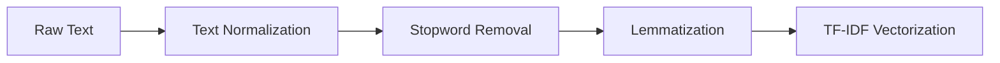

# Performance Analysis Report: Offensive Language Classification

## Table of Contents
- [Executive Summary](#executive-summary)
- [Data Analysis & Preprocessing](#data-analysis--preprocessing)
- [Model Implementation & Evaluation](#model-implementation--evaluation)
- [Optimization Strategies](#optimization-strategies)
- [Critical Analysis](#critical-analysis)
- [Recommendations](#recommendations)
- [Conclusion](#conclusion)

## Executive Summary
This analysis evaluates various machine learning approaches implemented for offensive language classification. The project compared traditional ML methods with deep learning architectures, focusing on performance metrics, computational efficiency, and practical applicability.

## Data Analysis & Preprocessing

### Dataset Characteristics
| Characteristic | Description |
|----------------|-------------|
| Initial State | Significant class imbalance in toxic vs non-toxic comments |
| Size | Training: 23,473 samples |
| Features | Text-based feedback with multiple classification labels |

### Preprocessing Pipeline


### Data Balancing
- **Method**: Undersampling majority class
- **Impact**: Balanced dataset with improved minority class recognition
- **Trade-off**: Reduced total training samples but better class representation

## Model Implementation & Evaluation

### 1. Logistic Regression (Baseline)
| Metric | Value |
|--------|--------|
| Accuracy | 79.52% |
| Precision | 39.67% |
| Recall | 54.48% |
| F1 Score | 45.91% |
| AUC-ROC | 69.38% |

**Implementation Details:**
```python
tfidf = TfidfVectorizer(max_features=5000, ngram_range=(1, 2))
logreg = MultiOutputClassifier(
    LogisticRegression(class_weight='balanced', max_iter=1000),
    n_jobs=-1
)
```

### 2. Random Forest
| Metric | Value |
|--------|--------|
| Accuracy | 74.05% |
| Precision | 23.75% |
| Recall | 28.36% |
| F1 Score | 25.85% |
| AUC-ROC | 55.54% |

**Implementation Details:**
```python
rf = MultiOutputClassifier(
    RandomForestClassifier(
        class_weight='balanced',
        n_estimators=100,
        random_state=42,
        n_jobs=-1
    )
)
```

### 3. Bidirectional LSTM with Attention
| Metric | Value |
|--------|--------|
| Accuracy | 85.00% |
| Precision (Toxic) | 67.00% |
| Recall (Toxic) | 18.00% |
| F1-Score (Toxic) | 28.00% |
| AUC-ROC | 58.90% |

**Architecture:**
```python
model = Sequential([
    Embedding(input_dim=5000, output_dim=128, input_length=200),
    Bidirectional(LSTM(64, return_sequences=True)),
    Attention(),
    Dense(64, activation='relu'),
    Dense(1, activation='sigmoid')
])
```

**Training Configuration:**
```python
model.compile(
    optimizer=Adam(lr=0.001),
    loss='binary_crossentropy',
    metrics=['accuracy', AUC]
)
```

## Optimization Strategies

### 1. Optimizer Comparison
| Optimizer | Learning Rate | Additional Parameters |
|-----------|---------------|----------------------|
| Adam | 0.001 | - |
| AdamW | 0.001 | weight_decay=0.004 |
| SGD | 0.01 | momentum=0.9, nesterov=True |

### 2. Loss Function Optimization
```python
# Binary Focal Cross-entropy Implementation
loss = BinaryFocalCrossentropy(gamma=2.0)
```

### 3. Training Enhancements
- Early stopping (patience=5)
- Class weights: {0:1, 1:5}
- Threshold optimization (0.5 → 0.9)

## Critical Analysis

### Performance Comparison
| Model | Strengths | Limitations |
|-------|-----------|-------------|
| Logistic Regression | • Best overall accuracy (79.52%)<br>• Fast training & inference<br>• Good baseline performance | • Limited feature interaction learning |
| Random Forest | • Good feature importance insights<br>• No scaling needed | • Overfitting observed<br>• Lower performance metrics |
| BiLSTM + Attention | • Best precision for toxic class (67%)<br>• Complex pattern recognition | • Long training time<br>• Resource intensive |

### Challenges Identified

1. **Class Imbalance**
   ```python
   # Initial Distribution
   toxic_ratio = len(df_train[df_train['toxic'] == 1]) / len(df_train)
   # Result: Significant imbalance requiring mitigation
   ```

2. **Performance Trade-offs**
   - Precision vs Recall balance
   - Model complexity vs Performance gains
   - Training time vs Accuracy improvements

## Recommendations

### Immediate Actions
1. **Model Selection**
   - Quick Deployment: Logistic Regression
   - High Precision Needs: LSTM with attention
   - Balanced Approach: Ensemble both models

2. **Performance Optimization**
   ```python
   # Recommended threshold adjustment
   threshold = 0.9  # Optimized for precision
   predictions = (model.predict(X_val) > threshold).astype(int)
   ```

### Future Improvements

1. **Data Enhancement**
   - Implement SMOTE for balanced sampling
   - Augment minority class samples
   - Enhance text preprocessing pipeline

2. **Architecture Improvements**
   ```python
   # Proposed ensemble approach
   def ensemble_predict(lstm_pred, logreg_pred, weights=[0.6, 0.4]):
       return np.average([lstm_pred, logreg_pred], weights=weights, axis=0)
   ```

3. **Optimization Tasks**
   - [ ] Implement cross-validation
   - [ ] Fine-tune hyperparameters
   - [ ] Develop model pruning strategy

## Conclusion
The analysis demonstrates the viability of machine learning approaches for offensive language classification. The Logistic Regression model provides the best balance of performance and simplicity, while the LSTM model shows promise for high-precision requirements. Future work should focus on addressing the identified challenges and implementing the suggested improvements.


